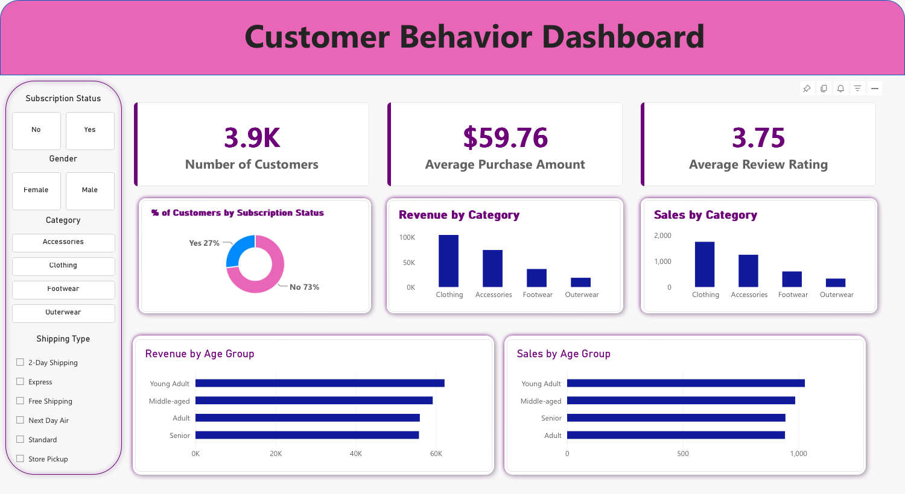

# Customer Shopping Behavior Analysis

[](https://www.python.org/)
[](https://www.postgresql.org/)
[](https://powerbi.microsoft.com/)

An analysis of 3,900 retail purchases: I cleaned the data in Python, loaded it
into PostgreSQL, answered ten business questions in SQL, and built a Power BI
dashboard on top.



## What I did

1. Cleaned the data with pandas. The dataset has 3,900 purchase records and 18
   columns (demographics, purchase amounts, discounts, ratings, shipping). 37
   review ratings were missing, so I filled each one with the median rating
   for its product category.
2. Renamed the columns to snake_case and added two features: an age group
   (four equal-sized bands, from Young Adult to Senior) and the purchase
   frequency converted to days, so "Weekly" becomes 7 and "Quarterly" 90.
3. Checked whether `discount_applied` and `promo_code_used` ever differ. They
   don't, so I dropped one.
4. Loaded the cleaned table into PostgreSQL with SQLAlchemy.
5. Wrote ten SQL queries, one per question in
   `sql/business_analysis_queries.sql`. They use CTEs, window functions
   (`ROW_NUMBER`) and conditional aggregation: for example, the top three
   products in each category, and customers split into New, Returning and
   Loyal by their number of previous purchases.
6. Built the Power BI dashboard, with KPI cards, category and sales charts,
   and slicers for subscription status, gender, category and shipping type.

## What I found

- Male shoppers account for 67.7% of revenue ($157.9K, against $75.2K for
  female shoppers).
- Only 27% of customers (1,053) have a subscription, and subscribers don't
  spend more per order: $59.49 on average, against $59.87 for non-subscribers.
- Clothing is the biggest category by both orders and revenue (over $100K),
  followed by Accessories, Footwear and Outerwear.
- About half of all Hat, Sneaker and Coat purchases (47–50%) were made with a
  discount, which makes those the most price-sensitive products.
- 3,116 customers fall into the Loyal segment.

## What I'd do with it

- The subscription isn't increasing order size, so it needs a reason to buy
  more: tiered perks or member-only products.
- Most customers are already loyal, so retention is likely a better use of
  budget than discounts aimed at new buyers.
- Discounts are heaviest on a few product lines. I'd cut back there and save
  promo codes for stock that isn't selling.

## Running it

The script loads the data into a local PostgreSQL database called
`customer_behavior`. It reads the database password from an environment
variable, so no credentials are in the code:

```bash
export DB_PASSWORD="your-postgres-password"
python notebooks/eda_and_data_cleaning.py
```

## Files

```
notebooks/   cleaning and feature engineering (notebook and script)
sql/         the ten analysis queries
data/        the cleaned dataset
dashboard/   the Power BI file and a preview image
```
